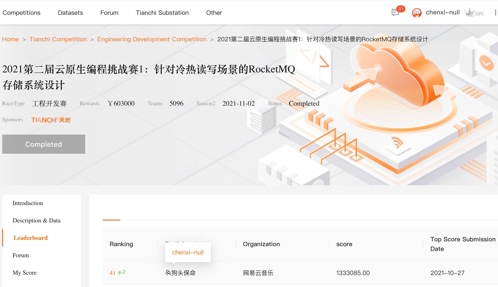

# My Middleware Challenge Solution Code

## Competition Link
[2021 2nd Cloud Native Programming Challenge 1: RocketMQ Storage System Design for Cold and Hot Read/Write Scenarios](https://tianchi.aliyun.com/competition/entrance/531922/information?spm=a2c22.12281976.0.0.bc163b32AlOyHd)

## Ranking
41/5096


## Languages
- [English](README.md)
- [中文](README-zh.md)

---

# Competition Problem Description

> **Note Before Coding:**
> 1. Please read the following content carefully before starting to code.

## 1. Problem Description
Apache RocketMQ, as a distributed message middleware, has been carrying trillions of messages during the Double 11 shopping festival over the years, providing high-performance, low-latency, stable, and reliable message services to business parties. Real-time reading and writing of data, as well as reading historical data, are common storage access scenarios in business, and they often occur simultaneously. Therefore, optimizing for this mixed read/write scenario can greatly enhance the stability of the storage system. Additionally, Intel® Optane™ Persistent Memory, as a unique standalone storage device, can bridge the gap between traditional memory and storage, potentially providing a new lever for RocketMQ's performance leap.

## 2. Problem Content
Implement a standalone storage engine that provides the following interfaces to simulate message storage scenarios:

### Write Interface
- `long append(String topic, int queueId, ByteBuffer data)`
  - Write variable-length messages to a specific queue under a topic. The returned offset must be ordered.

**Example:**
Write messages in the following order:
```json
{"topic": "a", "queueId": 1001, "data": 2021}
{"topic": "b", "queueId": 1001, "data": 2021}
{"topic": "a", "queueId": 1000, "data": 2021}
{"topic": "b", "queueId": 1001, "data": 2021}
```
Return results:
```
0
0
0
1
```

### Read Interface
- `Map<Integer, ByteBuffer> getRange(String topic, int queueId, long offset, int fetchNum)`
  - The returned `Map<offset, bytebuffer>` has the offset as the sequential offset in the Map, starting from 0.

**Example:**
```java
getRange("a", 1000, 1, 2)
Map{}

getRange("b", 1001, 0, 2)
Map{"0": "2021", "1": "2021"}

getRange("b", 1001, 1, 2)
Map{"0": "2021"}
```

The evaluation environment provides 128G of Optane persistent memory, encouraging participants to use it to improve performance.

## 3. Language Restriction
JAVA

## 4. Program Objective
Carefully read the `MessageStore` and `DefaultMessageStoreImpl` classes in the demo project.

Your coding goal is to implement `DefaultMessageStoreImpl`.

**Note:**
Logs should be printed directly to the console standard output. The evaluation program will collect the content of the console standard output for users to troubleshoot, but please do not print logs intensively. The maximum log size per evaluation should not exceed 100M; exceeding this limit will result in truncation.

## 5. Test Environment Description
1. **ECS Specification:** 4 cores, 8GB RAM, configured with 400G ESSD PL1 cloud disk (throughput up to 350MiB/s), and 126G Optane™ persistent memory.
2. **Java Language Level:** Restricted to Java 8.
3. **Allowed Libraries:** `llpl` library is pre-installed in the environment; participants should include it as `provided`.
4. **Logging Library:** `log4j2` is pre-installed in the environment; participants should include it as `provided`.
5. **Prohibited:** Use of JNI and other third-party libraries is not allowed.

## 6. Performance Evaluation
The evaluation program will create 20~40 threads, each thread randomly selecting several topics (total topics <= 100), each topic with N queueIds (1 <= N <= 10,000), continuously calling the `append` interface for writing. The evaluation ensures that the data volume per thread is similar (not guaranteed between topics). Each data size is randomly between 100B-17KiB (pseudo-random level of randomness), and the data is almost incompressible, requiring a total write volume of 150GiB.

While maintaining the previous write pressure, randomly select 50% of the queues to read from the current maximum point, and the remaining queues to read from the minimum point (i.e., from the beginning). After writing a total of 100GiB, stop all writes and continue reading until there is no more data, then stop.

The evaluation considers the total time taken for the entire process. The timeout is 1800 seconds; exceeding this limit will result in forced exit.

The final ranking will change the evaluation data.

## 7. Correctness Evaluation
Write several pieces of data.

**Restart the ESC and clear the data on the Optane disk.**

Read the data again, which must strictly equal the previously written data.

## 8. Ranking and Evaluation Rules
On the premise of passing the correctness evaluation, the ranking is based on the performance evaluation time, from the shortest to the longest.

We will review the code of the top-ranked participants. If we find a large amount of copied code from others, we will adjust the ranking accordingly.

All messages should be stored according to the actual sent information; compression or falsification is not allowed.

The program should not be optimized specifically for data patterns; all optimizations must be general for random data.

If cheating is detected, such as hacking the evaluation program and bypassing the necessary evaluation logic, the program will be invalid, and the participant's qualification will be canceled.

## 9. Participation Method
Find "Cloud Native Programming Challenge" on Alibaba Tianchi and sign up.

Register an account on `code.aliyun.com`, create a new repository, and add the official account `cloudnative-contest` as a project member with Reporter permissions.

Fork or copy the `mqrace2021` repository code to your own repository and implement your logic; note that the implemented code must be placed in the specified package, otherwise, it will not be included in the evaluation.

Submit your repository git address in the Tianchi submission entry and wait for the evaluation results.

Save the log file in time, as it will only be saved for one day.
